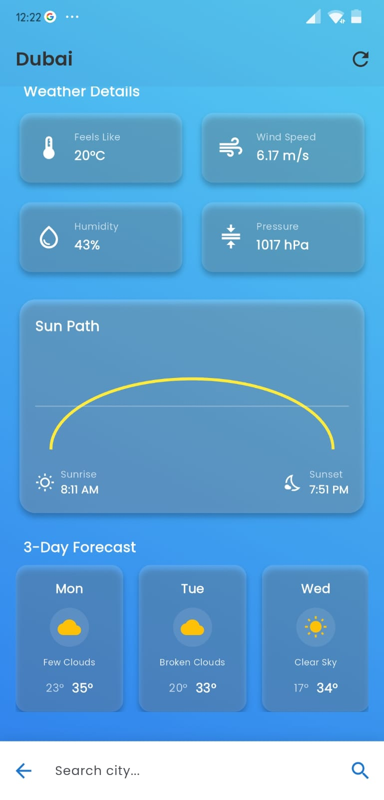
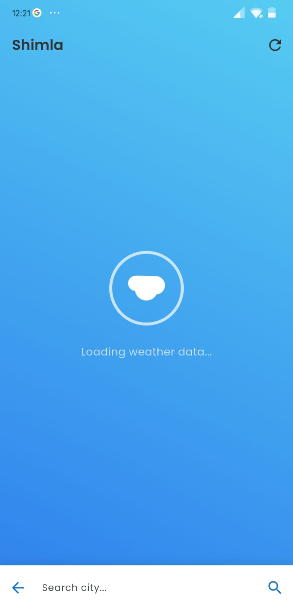
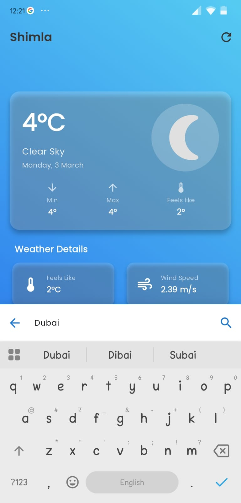
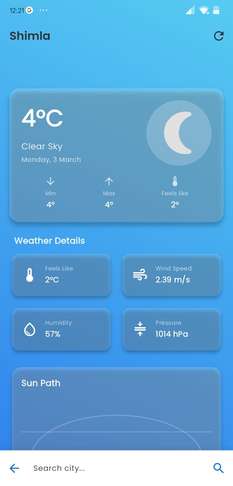

# Weather App

A beautiful weather application built with Flutter that displays current weather conditions, forecasts, and animated sun path visualization.

## Features

- 🌡️ Current weather data including temperature, feels like, humidity, pressure, and wind speed
- 🌅 Animated sun path visualization showing sunrise and sunset times
- 🔮 3-day weather forecast
- 🎨 Dynamic gradient backgrounds that change based on time of day and weather conditions
- 🔍 City search functionality
- 🔄 Pull-to-refresh for updated data
- ✨ Beautiful animations and transitions

### Screenshots
<p align="center">
  
  
  
</p>
<p align="center">
  
</p>

## Setup Instructions

### 1. Get API Key

Register for a free API key at [OpenWeatherMap](https://openweathermap.org/api).

### 2. Create .env file

Create a `.env` file in the root directory of the project and add your API key:

```
OPEN_WEATHER_API_KEY=your_api_key_here
```

### 3. Add Animation Files

Download Lottie animation files for weather conditions and place them in the `assets/animations/` directory. Refer to the README in that directory for more details.

### 4. Run the App

```bash
flutter pub get
flutter run
```

## Dependencies

- `http` - For API requests
- `intl` - For date and time formatting
- `geolocator` - For getting current location
- `flutter_dotenv` - For managing environment variables
- `google_fonts` - For using custom fonts
- `flutter_svg` - For SVG support
- `fl_chart` - For charts and visualizations
- `lottie` - For Lottie animations
- `provider` - For state management
- `shimmer` - For loading effects
- `flutter_animate` - For UI animations

## Project Structure

```
lib/
├── main.dart
├── models/
│   └── weather_model.dart
├── providers/
│   └── weather_provider.dart
├── screens/
│   └── home_screen.dart
├── services/
│   └── weather_service.dart
├── theme/
│   └── app_theme.dart
├── utils/
│   └── time_based_gradient.dart
└── widgets/
    ├── current_weather.dart
    ├── forecast_section.dart
    ├── loading_widget.dart
    ├── search_bar.dart
    ├── sun_path_chart.dart
    └── weather_details.dart
```

## License

This project is licensed under the MIT License.
